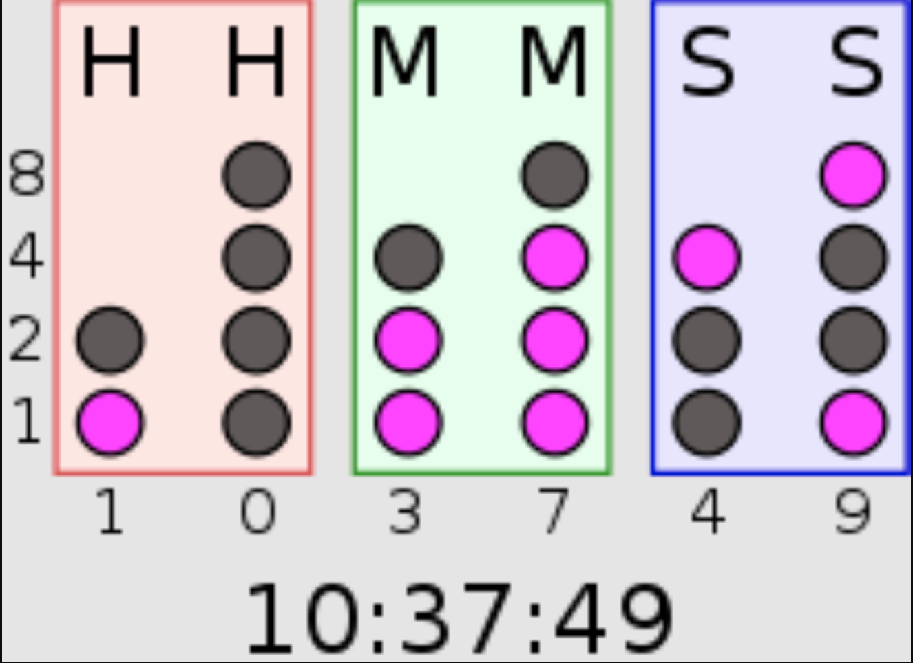

Binary Clock Ideation:

Binary Representation:
Represent hours, minutes, and seconds using rows of binary digits.
Each row should be visually distinct and labeled accordingly.

Interactive Elements:
Add interactive elements for users to toggle between different time units (hours, minutes, seconds).
Allow users to switch between 12-hour and 24-hour formats.

Color Scheme:
Choose a color scheme that is easy on the eyes and provides good contrast for binary digits.
Consider using different colors for each time unit to enhance clarity.

Tooltip Information:
Display tooltips or info boxes explaining the binary representation for each row.
Include information about how to read the clock.

User Preferences:
Implement user preferences to customize the appearance of the clock, such as font size and style.

Sound Effects:
Add optional sound effects for interactions, like toggling between time units.
Consider providing volume controls or mute options.

Responsive Design:
Ensure the clock is responsive and adapts to various screen sizes.
Optimize for both desktop and mobile experiences.

User Guide:
Include a brief README on how to read the binary clock.
Provide a link to additional resources for users interested in understanding binary representation.
Timezone Support:
Allow users to select their timezone and adjust the clock accordingly.
Display the current location or time zone prominently.

Error Handling:
Implement error handling for incorrect user inputs or unexpected behaviors.
Provide clear error messages or prompts for users.

Accessibility:
Ensure the clock is accessible to users with disabilities by following best practices for web accessibility.

Social Sharing:
Add social media sharing options for users to share their customized binary clocks.
Encourage users to showcase their clocks with unique themes.

